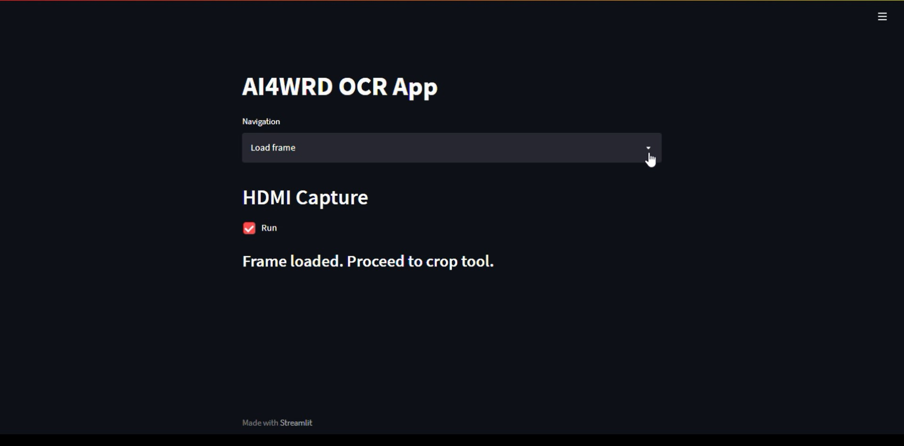
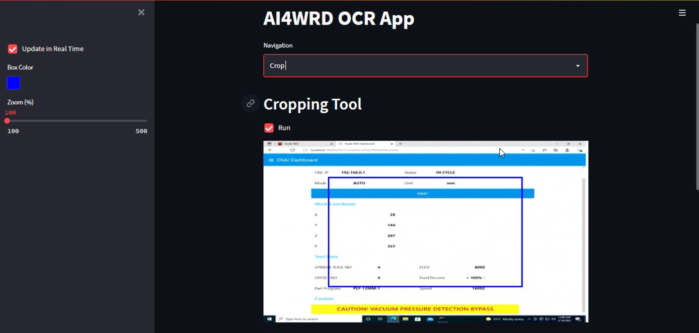
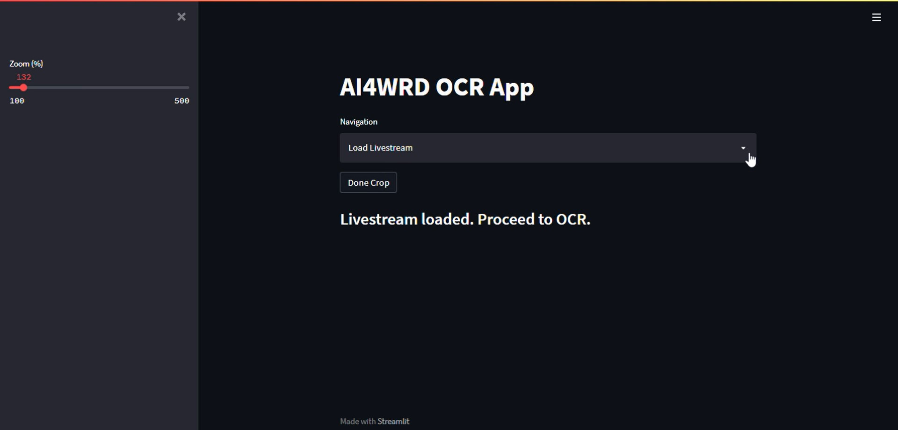
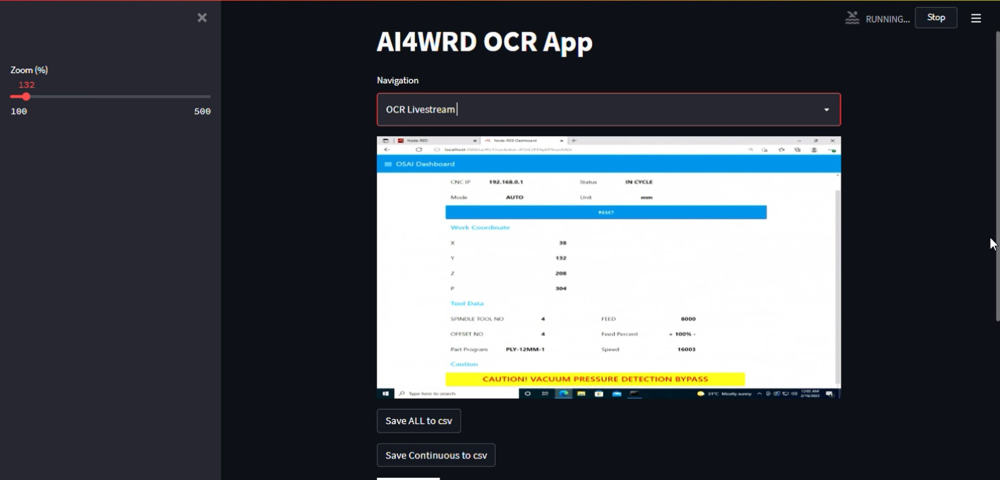
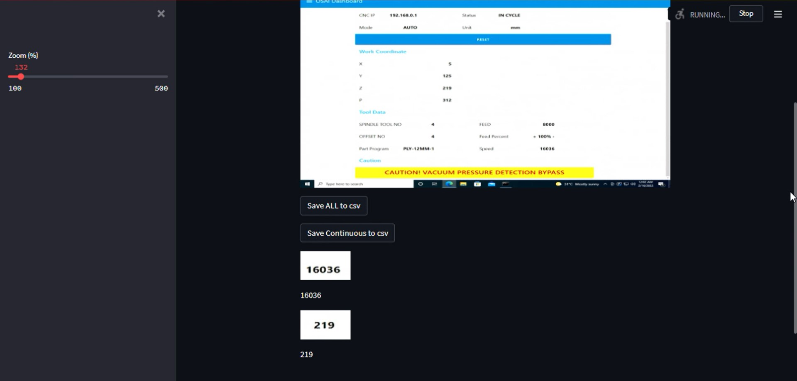

# AI4WRD-OCR
## Installation
* This app is currently only supported on Windows.
* It is advised to install the application on a device with a dedicated graphics card.
    * Current GPU specifications: NVIDEA Quadro P620 GPU

* Installation Guide: 

## User Guide
**Application startup**
1. When starting up the app, you will arrive at the home page, "Load Frame". This page loads the first frame of the video capture from your video device. 
2. Check the "Run" checkbox to load the first frame of your video capture.
3. A message will appear when the frame is fully loaded. You may proceed to the next page when the frame has loaded.

**Cropping tool**
1. In the "Crop" page, the loaded frame will be visible to you with a blue box.
2. You may drag the blue box to crop text on the visible frame. The OCR will be performed on these cropped sections of the live videostream on a later page. 
3. Select the "Save Crop" button to save the crop. Saved crops will appear at the bottom of the page. 
4. You may continue to add and store more crops. 
5. A zoom function is available on the sidebar for you to enlarge crops if the text appears to be too small.  Note that the OCR accuracy can be affected depending on the size and clarity of your cropped text. 
6. Proceed to the next page when you have finished cropping. 

**Livestream Loading**
1.  In the "Load Livestream" page, select "Done Crop" to start loading the livestream. 
2. A message will appear once the livestream is loaded. You may proceed to the final page, "OCR livestream" once the message is displayed. 

**OCR on Livestream**
1. In the "OCR Livestream" page, the livestream from your capture device will be visible at the top of the page. 
2. The livestream of the cropped sections will also appear below the main livestream along with the OCR result of each crop beneath it.
3.  The "Save Continuous to csv" button will allow you to continuously save new OCR data read from the crops into a csv file. The csv file will be saved under the folder in which you saved the Python program files. 
4. The "Save to csv" button allows you to save all the previous OCR data that was obtained before clicking the "Save to csv" button. 
5. Note that the zoom tool is still available for you to enlarge crops. 

